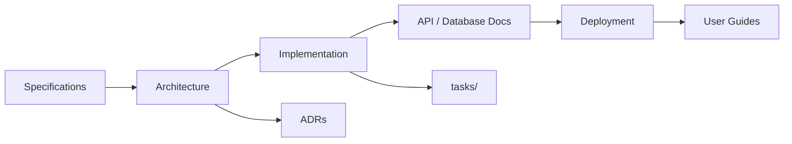

# Engineering Documentation Framework

A reusable documentation architecture for long-lived software projects. This repository defines **how** engineering teams organize, write, and maintain documentation — not the documentation of any single product.

## Overview

The Engineering Documentation Framework provides a consistent, scalable structure for capturing requirements, architecture, APIs, databases, deployment procedures, and day-to-day development practices. It is designed for teams that use Git as the source of truth and increasingly rely on AI-assisted development tools.

Adopt this framework as the documentation skeleton for new repositories. Copy or submodule it, then replace generic templates with project-specific content while preserving the folder layout and conventions.

## Goals

- **Consistency** — Every project uses the same documentation taxonomy, reducing onboarding friction.
- **Discoverability** — A single entry point (`PROJECT_INDEX.md`) maps readers to the right document quickly.
- **Longevity** — Structure supports projects that evolve over years, not weeks.
- **AI readiness** — Documents are written and organized so AI tools can retrieve, summarize, and act on them effectively.
- **Git-native workflow** — Documentation lives alongside code, is reviewed in pull requests, and versions with releases.

## Why This Framework Exists

Software projects outlive their original authors. Without a deliberate documentation architecture, knowledge scatters across wikis, chat threads, and tribal memory. New contributors waste time hunting for answers. Architecture decisions get re-litigated. Deployment steps live in one person's head.

This framework solves that by defining **where** information belongs, **how** it should be structured, and **which** documents are authoritative. It is intentionally generic so you can apply it to web services, libraries, data pipelines, mobile apps, or internal tools without rewriting the organizational model.

## Core Design Principles

1. **Single source of truth** — Git is canonical. External wikis may link here, but they do not replace version-controlled docs.
2. **Progressive disclosure** — High-level indexes point to detailed documents; readers drill down only when needed.
3. **Templates over blank pages** — Reusable templates (charter, ADRs, handbook sections) lower the cost of writing good documentation.
4. **Ownership and accountability** — Every major document has a named owner responsible for accuracy.
5. **AI-friendly structure** — Predictable headings, explicit purpose sections, and cross-links help both humans and AI agents navigate content.
6. **Archive, don't delete** — Superseded documents move to `archive/` with context, preserving history.

## Benefits

| Benefit | How the framework delivers it |
|--------|--------------------------------|
| Faster onboarding | Developer Handbook + PROJECT_INDEX give new contributors a clear starting path |
| Better architecture hygiene | ADR template encourages recording decisions with context and alternatives |
| Safer deployments | Dedicated Deployment docs separate runbooks from architecture |
| Traceable requirements | Specifications folder isolates what from how |
| Effective AI pairing | AI_WORKFLOW.md defines tool roles; docs use consistent patterns AI can parse |
| Multi-developer scale | Ownership model and Git workflow reduce documentation conflicts |

## Repository Structure

```
.
├── README.md                    # This file — framework overview
├── PROJECT_INDEX.md             # Master navigation and status dashboard
├── PROJECT_CHARTER.md           # Project charter template
├── ARCHITECTURE_DECISIONS.md    # ADR index and template
├── AI_WORKFLOW.md               # AI tool roles across the SDLC
├── CHANGELOG.md                 # Framework version history
│
├── docs/
│   ├── Developer_Handbook/      # Day-to-day engineering practices
│   ├── Architecture/            # System design, diagrams, ADRs
│   ├── API/                     # API contracts and references
│   ├── Database/                # Schema, migrations, data model
│   ├── Deployment/              # Environments, CI/CD, runbooks
│   ├── Specifications/          # Requirements and functional specs
│   └── User_Guides/             # End-user documentation
│
├── tasks/                       # Active work tracking (issues, epics, checklists)
└── archive/                     # Retired or superseded documents
```

## How to Use This Framework

### Bootstrap folder structure

Run the canonical layout scripts against an **existing software project's root** to add the framework folder layout and, if missing, a local adoption guide (`ENGINEERING_DOCUMENTATION_FRAMEWORK.md`). Pass the target project root explicitly — the scripts do not assume they are run from that directory.

- **Unix / macOS / Linux:** `./scripts/create_canonical_structure.sh "/path/to/project root"`
- **Windows (PowerShell):** `.\scripts\create_canonical_structure.ps1 -ProjectRoot "D:\Projects\The Recipe Vault"`

The scripts create missing canonical directories and `ENGINEERING_DOCUMENTATION_FRAMEWORK.md` only when that file does not already exist. They never create README files inside generated folders. Any existing `documents/` folder is left completely untouched.

These scripts only create missing directories and the optional framework guide file. They do not delete, overwrite, move, rename, or modify existing files.

### For a new project

1. **Copy or fork** this repository (or use it as a Git submodule at `docs/`), then run a structure script above against your project root.
2. **Rename** the repository to your project name; keep the internal folder layout.
3. **Fill in** `PROJECT_CHARTER.md` with your project's mission, scope, and stakeholders.
4. **Update** `PROJECT_INDEX.md` with current status, owners, and links to live documents.
5. **Customize** Developer Handbook sections for your stack and team conventions.
6. **Record** your first ADR in `ARCHITECTURE_DECISIONS.md` when you make a significant technical choice.
7. **Add** project-specific content under each `docs/` subdirectory as the system grows.

### For an existing project

1. **Audit** existing documentation and map each artifact to the closest framework folder.
2. **Migrate** content incrementally; link old locations in `archive/` with a short migration note.
3. **Adopt** templates for new documents only at first; refactor legacy docs over time.
4. **Point** your root `README.md` to `PROJECT_INDEX.md` as the documentation hub.

## Recommended Workflow

1. **Plan** — Capture requirements in `docs/Specifications/`; update the charter for scope changes.
2. **Design** — Document architecture in `docs/Architecture/`; log decisions as ADRs.
3. **Build** — Follow the Developer Handbook; track active work in `tasks/`.
4. **Review** — Include documentation updates in the same pull request as code changes.
5. **Release** — Update `CHANGELOG.md`, deployment docs, and API references before tagging.
6. **Operate** — Maintain runbooks in `docs/Deployment/`; archive obsolete material.



## Using AI During Software Development

AI tools accelerate research, drafting, refactoring, and review — but they require well-structured context to be reliable. This framework supports AI-assisted development by:

- Keeping **machine-readable structure** (consistent headings, explicit purpose sections).
- Centralizing **workflow guidance** in `AI_WORKFLOW.md`.
- Co-locating **authoritative docs** with code so agents can read them via repository context.
- Defining **human accountability** — AI proposes; humans approve and own outcomes.

See [AI_WORKFLOW.md](./AI_WORKFLOW.md) for tool-specific roles and when to use each.

## Version Control Philosophy

- **Docs are code** — Documentation changes go through the same review process as application code.
- **Atomic updates** — When behavior changes, update the relevant doc in the same commit or PR.
- **Meaningful commits** — Commit messages should describe documentation impact (e.g., `docs: add ADR-003 for caching layer`).
- **Branches and PRs** — Use feature branches; request review for substantive doc changes.
- **Tags and releases** — Bump framework or project versions in `CHANGELOG.md` when publishing releases.
- **No silent drift** — If code and docs disagree, treat it as a defect.

## Contributing

Contributions that improve the **framework itself** (templates, structure, conventions) are welcome.

1. Fork the repository and create a feature branch.
2. Make focused changes with clear rationale.
3. Update `CHANGELOG.md` under `[Unreleased]`.
4. Open a pull request describing what problem your change solves.
5. Ensure Markdown renders correctly and links resolve.

For projects that **adopt** this framework, contribution guidelines belong in your project's charter and Developer Handbook — customize those sections for your team.

## License

This framework is released under the [MIT License](./LICENSE). You are free to use, modify, and distribute it in your own projects. Attribution is appreciated but not required.

---

**Next step:** Open [PROJECT_INDEX.md](./PROJECT_INDEX.md) to navigate the framework, or start with [PROJECT_CHARTER.md](./PROJECT_CHARTER.md) when bootstrapping a new project.
