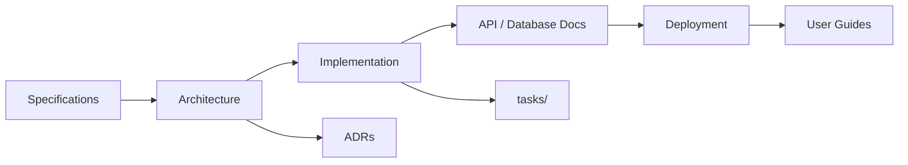

# Engineering Documentation Framework

A reusable documentation architecture for long-lived engineering projects.

This repository defines **how** teams organize, write, and maintain documentation across disciplines — not the documentation of any single product. It ships as the **Software Engineering reference implementation** of EDF Core plus the Software Engineering Domain Profile.

## Overview

The Engineering Documentation Framework provides a consistent, scalable structure for capturing requirements, architecture, governance, AI engineering guidance, and discipline-specific deliverables.

**EDF Core** is domain-independent: navigation, governance, specifications, architecture, reference, and the AI handbook apply to any engineering project.

**Domain Profiles** extend Core with discipline-specific folders and validation — for example, APIs and deployment for software, or scores and curriculum for music education. See [ADR-0001 — Domain Profiles](./docs/Architecture/ADRs/ADR-0001-Domain-Profiles.md).

This repository includes the full Software Engineering profile (`docs/API`, `docs/Database`, `docs/Deployment`, `docs/Developer_Handbook`) as the v1.0 reference layout. Non-software adopters will not be required to use those paths once profile-aware validation ships post-v1.0.

## Goals

- **Consistency** — Every project uses the same documentation taxonomy, reducing onboarding friction.
- **Discoverability** — A single entry point (`PROJECT_INDEX.md`) maps readers to the right document quickly.
- **Longevity** — Structure supports projects that evolve over years, not weeks.
- **AI readiness** — Documents are written and organized so AI tools can retrieve, summarize, and act on them effectively.
- **Git-native workflow** — Documentation lives alongside code, is reviewed in pull requests, and versions with releases.

It is designed for teams that use Git as the source of truth and increasingly rely on AI-assisted development tools.

Adopt EDF Core for any engineering discipline. Select the Software Engineering profile (this repository's default layout) for software projects, or a future profile for other domains. Copy or submodule this repository, then replace generic templates with project-specific content while preserving Core conventions.

## Why This Framework Exists

Engineering projects outlive their original authors. Without a deliberate documentation architecture, knowledge scatters across wikis, chat threads, and tribal memory. New contributors waste time hunting for answers. Architecture decisions get re-litigated. Critical procedures live in one person's head.

This framework solves that by defining **where** information belongs, **how** it should be structured, and **which** documents are authoritative.

Software was the first domain; the same model applies to music education, hardware, research, and other disciplines through Domain Profiles — without forcing every project into software folders.

## Core Design Principles

1. **Single source of truth** — Git is canonical. External wikis may link here, but they do not replace version-controlled docs.
2. **Progressive disclosure** — High-level indexes point to detailed documents; readers drill down only when needed.
3. **Templates over blank pages** — Reusable templates lower the cost of writing good documentation.
4. **Ownership and accountability** — Every major document has a named owner responsible for accuracy.
5. **AI-friendly structure** — Predictable headings, explicit purpose sections, and cross-links help both humans and AI agents navigate content.
6. **Archive, don't delete** — Superseded documents move to `archive/` with context, preserving history.
7. **Document architecture matters** — Documentation should be organized as an engineered system, not accumulated as unrelated Markdown files.

See [Documentation Information Architecture](./docs/Architecture/Documentation_Information_Architecture.md) for the framework's authoritative guidance on documentation domains, Core vs profile boundaries, ownership, cross-references, and where information belongs.

## EDF Core and Domain Profiles

```text
EDF Core (domain-independent)
    │
    ├── Domain Profile: Software Engineering  ← this repository (v1.0 reference)
    ├── Domain Profile: Music Education       ← future
    └── Domain Profile: …                     ← future profiles
```

**Extraction principle:** Software-specific requirements (API, database, deployment, developer handbook) belong in the Software Engineering profile, not in Core. Non-software projects must not fight irrelevant validation rules.

Profile implementation (manifests, profile-aware Framework Advisor, bootstrap `--profile`) is documented in [ADR-0002](./docs/Architecture/ADRs/ADR-0002-Domain-Profile-Specification.md) and deferred until after v1.0.

## Benefits

| Benefit | How the framework delivers it |
|--------|--------------------------------|
| Faster onboarding | `PROJECT_INDEX.md` and profile handbooks give contributors a clear starting path |
| Better architecture hygiene | ADR templates encourage recording decisions with context and alternatives |
| Safer deployments | Software profile Deployment docs separate runbooks from architecture |
| Traceable requirements | Specifications folder isolates what from how |
| Effective AI pairing | The AI Engineering Handbook defines tool roles, prompting, context, verification, security, and governance |
| Multi-developer scale | Ownership model and Git workflow reduce documentation conflicts |
| Cross-discipline reuse | EDF Core stays stable; Domain Profiles add discipline-specific structure without forking the framework |

## Repository Structure

This repository contains **EDF Core** paths plus the **Software Engineering profile** paths used for v1.0 self-hosting.

### EDF Core

```text
.
├── README.md
├── PROJECT_INDEX.md
├── PROJECT_CHARTER.md
├── ARCHITECTURE_DECISIONS.md
├── CHANGELOG.md
│
├── docs/
│   ├── Architecture/                 # System design, ADRs, documentation architecture
│   ├── AI/                           # AI Engineering Handbook
│   ├── Governance/                   # Document metadata, lifecycle, ownership
│   ├── Development/                  # Framework adoption tooling and guides
│   ├── Specifications/               # Requirements and functional specs
│   ├── User_Guides/                  # End-user documentation
│   ├── Reference/                    # Glossary, standards, terminology
│   └── Templates/                    # Reusable documentation templates
│
├── scripts/
├── tasks/
└── archive/
```

### Software Engineering profile (included in this repository)

```text
docs/
    ├── API/                          # API contracts and references
    ├── Database/                     # Schema, migrations, data model
    ├── Deployment/                   # Environments, CI/CD, runbooks
    └── Developer_Handbook/           # Day-to-day software engineering practices
```

### Combined layout (v1.0 reference implementation)

```text
.
├── README.md
├── PROJECT_INDEX.md
├── PROJECT_CHARTER.md
├── ARCHITECTURE_DECISIONS.md
├── CHANGELOG.md
├── docs/                             # Core + Software Engineering profile (see above)
├── scripts/
├── tasks/
└── archive/
```

## How to Use This Framework

### Bootstrap folder structure

Run the canonical layout scripts against an **existing project's root** to add the framework folder layout and, if missing, a local adoption guide (`ENGINEERING_DOCUMENTATION_FRAMEWORK.md`).

**v1.0 note:** Bootstrap currently creates the Software Engineering profile directories for all projects. Profile selection and Core-only bootstrap are planned post-v1.0 per [ADR-0002](./docs/Architecture/ADRs/ADR-0002-Domain-Profile-Specification.md).

Pass the target project root explicitly — the scripts do not assume they are run from that directory.

- **Unix / macOS / Linux:**

  ```bash
  ./scripts/create_canonical_structure.sh "/path/to/project root"
  ```

- **Windows (PowerShell):**

  ```powershell
  .\scripts\create_canonical_structure.ps1 -ProjectRoot "D:\Projects\The Recipe Vault"
  ```

The scripts create missing canonical directories and `ENGINEERING_DOCUMENTATION_FRAMEWORK.md` only when that file does not already exist. They never create README files inside generated folders.

Any existing `documents/` folder is left completely untouched.

These scripts only create missing directories and the optional framework guide file. They do not delete, overwrite, move, rename, or modify existing files.

### First-time setup (Software Engineering profile)

New software contributors start with [docs/Developer_Handbook/00_First_Time_Setup.md](docs/Developer_Handbook/00_First_Time_Setup.md). That guide links to the authoritative setup sections in the Developer Handbook, Database, Architecture, and Deployment domains.

### Analyze an existing project

Use the project analysis tool to inspect how closely an existing project follows the framework structure.

- **Unix / macOS / Linux:**

  ```bash
  ./scripts/analyze_project_structure.sh "/path/to/project root"
  ```

- **Windows (PowerShell):**

  ```powershell
  .\scripts\analyze_project_structure.ps1 -ProjectRoot "D:\Projects\The Recipe Vault"
  ```

The analysis tool is read-only. It reports missing folders, missing key files, Markdown files outside canonical locations, and documentation structure issues.

To save a timestamped conformance report inside the adopting project, use the conformance validation wrapper from the EDF repository:

```bash
/path/to/Engineering-Documentation-Framework/scripts/run_conformance_validation.sh "/path/to/project root"
```

Reports are written to `reports/conformance/` in the target project. See [scripts/README.md](./scripts/README.md) for details.

### Plan documentation migration

Use the documentation migration assistant to generate a suggested migration plan for existing Markdown files.

- **Unix / macOS / Linux:**

  ```bash
  ./scripts/plan_documentation_migration.sh "/path/to/project root"
  ```

- **Windows (PowerShell):**

  ```powershell
  .\scripts\plan_documentation_migration.ps1 -ProjectRoot "D:\Projects\The Recipe Vault"
  ```

The migration assistant is read-only. It recommends destinations but does not move, delete, or modify files.


## Generate a Cross-Linked Documentation Skeleton

After creating the canonical folders, you can generate missing starter documents and domain indexes:

- **Unix / macOS / Linux:**

```bash
./scripts/generate_documentation_skeleton.sh "/path/to/project root"
```

- **Windows (PowerShell):**

```powershell
.\scripts\generate_documentation_skeleton.ps1 -ProjectRoot "D:\Projects\Existing Project"
```

The generator creates only files that do not already exist. It never overwrites, edits, renames, moves, merges into, or deletes an existing file.

Generated documents include working hierarchical navigation links so users can move between:

```text
README.md
    -> PROJECT_INDEX.md
        -> domain README.md
            -> individual documents
```

If a target file already exists, the generator reports it as skipped and leaves it unchanged. See [Framework Generation Principles](./docs/Architecture/Framework_Generation_Principles.md) and [Documentation Generation Engine](./docs/Development/Documentation_Generation_Engine.md).


## For a New Project

1. **Copy or fork** this repository, then run a structure script against your project root.
2. **Rename** the repository to your project name; keep the internal folder layout.
3. **Fill in** `PROJECT_CHARTER.md` with your project's mission, scope, and stakeholders.
4. **Update** `PROJECT_INDEX.md` with current status, owners, and links to live documents.
5. **Customize** profile-specific handbook sections for your stack and team conventions (Software Engineering: Developer Handbook).
6. **Record** your first ADR in `ARCHITECTURE_DECISIONS.md` when you make a significant technical choice.
7. **Add** project-specific content under each `docs/` subdirectory as the system grows.

---

## Adopting the Framework in an Existing Project

The Engineering Documentation Framework is designed to be adopted by both new and existing engineering projects. Software projects use the Software Engineering profile layout in this repository; other disciplines will use future Domain Profiles on top of EDF Core.

For existing projects, the framework can be introduced incrementally without disrupting the current project structure or development workflow.

Two adoption approaches are supported:

- **Script-Assisted Adoption (Recommended)** — Quickly create the canonical folder structure while preserving the existing project.
- **Manual Adoption** — Create the structure manually and migrate documentation at your own pace.

Regardless of the approach used, documentation should be migrated incrementally into the canonical framework.

---

## Option 1 — Script-Assisted Adoption (Recommended)

The recommended workflow is:

1. Clone the Engineering Documentation Framework repository locally.
2. Review the framework documentation to understand its organization and philosophy.
3. Run the canonical structure script against the root folder of the existing project.
4. Review the generated folder structure.
5. Audit and migrate existing documentation into the framework over time.

### Safety Guarantee

The setup scripts are intentionally conservative.

They **only** create missing framework directories and, if it does not already exist, a single project guide file:

```text
ENGINEERING_DOCUMENTATION_FRAMEWORK.md
```

The scripts **never**:

- Delete files
- Overwrite files
- Rename files
- Move files
- Modify existing documentation
- Modify an existing `documents/` folder

The canonical documentation root used by the Engineering Documentation Framework is always:

```text
docs/
```

If an existing project already contains a `documents/` folder, it is treated as legacy or project-specific content and is left completely untouched.

### PowerShell (Windows)

From the cloned Engineering Documentation Framework repository:

```powershell
.\scripts\create_canonical_structure.ps1 -ProjectRoot "D:\Projects\Existing Project"
```

### Bash (macOS / Linux)

From the cloned Engineering Documentation Framework repository:

```bash
./scripts/create_canonical_structure.sh "/Users/ed/Projects/Existing Project"
```

### Result

After running the script, the target project will contain the canonical documentation structure:

```text
project-root/
├── docs/
│   ├── Architecture/
│   │   └── ADRs/
│   ├── AI/
│   ├── Development/
│   ├── Specifications/
│   ├── API/
│   ├── Database/
│   ├── Deployment/
│   ├── User_Guides/
│   ├── Reference/
│   └── Templates/
├── tasks/
├── archive/
├── scripts/
└── ENGINEERING_DOCUMENTATION_FRAMEWORK.md
```

The generated `ENGINEERING_DOCUMENTATION_FRAMEWORK.md` file serves as the local adoption guide for the project. It explains the purpose of each canonical folder, identifies the authoritative documentation locations, and provides guidance for organizing project documentation according to the Engineering Documentation Framework.

---

## Option 2 — Manual Adoption

If you prefer not to use the setup scripts, you can adopt the framework manually.

The recommended process is:

1. Create the canonical folder structure described by this framework.
2. Add `ENGINEERING_DOCUMENTATION_FRAMEWORK.md` to the project root as the local framework guide.
3. Begin migrating documentation incrementally using the migration process described below.

---

## Documentation Migration Process

Whether you adopt the framework using the setup scripts or manually, existing documentation should be migrated gradually rather than reorganized all at once.

The recommended migration process is:

1. **Audit** existing documentation and map each document to the most appropriate framework folder or documentation domain.
2. **Migrate** documents incrementally into the canonical structure. When practical, leave a short migration note in the original location or move superseded material into `archive/`.
3. **Adopt** framework templates for all new documentation. Legacy documents can be refactored into the framework over time rather than rewritten immediately.
4. **Establish** `PROJECT_INDEX.md` as the primary documentation hub. Update the project's root `README.md` to direct developers to `PROJECT_INDEX.md` for navigating project documentation.

---

## Incremental Adoption Philosophy

The Engineering Documentation Framework is intended to evolve alongside a project — not disrupt it.

Existing projects are not expected to reorganize every document immediately. Instead, documentation should gradually migrate toward the canonical structure as it is updated or expanded.

This approach minimizes risk, avoids unnecessary churn, preserves project history, and allows teams to realize the benefits of the framework without interrupting ongoing development.

---

## Recommended Workflow

1. **Plan** — Capture requirements in `docs/Specifications/`; update the charter for scope changes.
2. **Design** — Document architecture in `docs/Architecture/`; log decisions as ADRs.
3. **Build** — Follow the Developer Handbook; track active work in `tasks/`.
4. **Review** — Include documentation updates in the same pull request as code changes.
5. **Release** — Update `CHANGELOG.md`, deployment docs, and API references before tagging.
6. **Operate** — Maintain runbooks in `docs/Deployment/`; archive obsolete material.



## Using AI During Engineering Work

AI tools accelerate research, drafting, refactoring, implementation, and review — but they require well-structured context to be reliable.

This framework supports AI-assisted development by:

- keeping **machine-readable structure** with consistent headings, explicit purpose sections, and predictable domains
- maintaining `PROJECT_INDEX.md` as the primary navigation hub for humans and AI tools
- organizing AI development guidance in the [AI Engineering Handbook](./docs/AI/README.md)
- co-locating authoritative docs with code so agents can read them via repository context
- defining human accountability — AI proposes; humans approve and own outcomes

See [docs/AI/README.md](./docs/AI/README.md) for tool-specific roles, model-selection guidance, prompting practices, verification rules, security guidance, and governance.

## Version Control Philosophy

- **Docs are code** — Documentation changes go through the same review process as application code.
- **Atomic updates** — When behavior changes, update the relevant doc in the same commit or PR.
- **Meaningful commits** — Commit messages should describe documentation impact, such as `docs: add ADR-003 for caching layer`.
- **Branches and PRs** — Use feature branches; request review for substantive doc changes.
- **Tags and releases** — Bump framework or project versions in `CHANGELOG.md` when publishing releases.
- **No silent drift** — If code and docs disagree, treat it as a defect.

## Contributing

Contributions that improve the **framework itself** are welcome.

1. Fork the repository and create a feature branch.
2. Make focused changes with clear rationale.
3. Update `CHANGELOG.md` under `[Unreleased]`.
4. Open a pull request describing what problem your change solves.
5. Ensure Markdown renders correctly and links resolve.

For projects that **adopt** this framework, contribution guidelines belong in your project's charter and Developer Handbook — customize those sections for your team.

## License

This framework is released under the [MIT License](./LICENSE). You are free to use, modify, and distribute it in your own projects. Attribution is appreciated but not required.

---

**Next step:** Open [PROJECT_INDEX.md](./PROJECT_INDEX.md) to navigate the framework, or start with [PROJECT_CHARTER.md](./PROJECT_CHARTER.md) when bootstrapping a new project.
