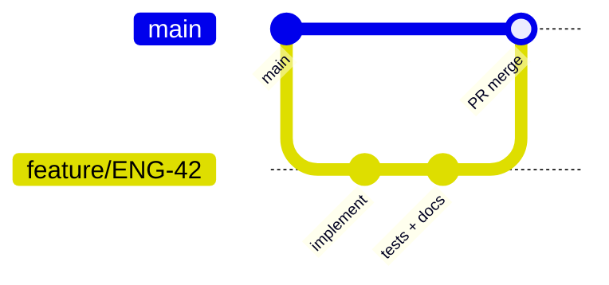

# Git Workflow

[Home](../../README.md) › [Project Index](../../PROJECT_INDEX.md) › [Developer Handbook](README.md) › Git Workflow


## Purpose

This document defines how the team uses Git for branching, committing, reviewing, and releasing software. A consistent workflow reduces merge conflicts, preserves audit history, and integrates documentation changes with code.

## When to use it

- **Every development task** — Before creating a branch or opening a PR.
- **Release planning** — Tagging, versioning, and hotfix procedures.
- **Documentation updates** — Same rules apply; docs are versioned with code.
- **Onboarding** — New contributors learn branch naming and commit conventions.
- **Incident hotfixes** — Follow the hotfix path defined here.

## Suggested contents

---

## Repository conventions

### Default branch

- **Primary branch:** `main` (protected)
- **Direct pushes to `main`:** _[Prohibited / emergency only]_
- **Required checks before merge:** _[CI, review approvals, lint]_

### Branch naming

| Type | Pattern | Example |
|------|---------|---------|
| Feature | `feature/<ticket>-<short-description>` | `feature/ENG-42-oauth-login` |
| Bug fix | `fix/<ticket>-<short-description>` | `fix/ENG-99-null-pointer` |
| Documentation | `docs/<short-description>` | `docs/deployment-runbook` |
| Chore / refactor | `chore/<short-description>` | `chore/upgrade-node-20` |
| Hotfix | `hotfix/<ticket>-<short-description>` | `hotfix/ENG-101-payment-timeout` |

Use lowercase and hyphens. Keep descriptions short but meaningful.

---

## Standard workflow



### Step-by-step

1. **Sync** — `git pull origin main`
2. **Branch** — Create a named branch from latest `main`
3. **Develop** — Make focused commits; include tests and doc updates
4. **Push** — `git push -u origin <branch>`
5. **Pull request** — Open PR with template completed
6. **Review** — Address feedback; keep PR reasonably small
7. **Merge** — Squash or merge per team policy (see below)
8. **Cleanup** — Delete branch after merge

---

## Commit messages

Follow [Conventional Commits](https://www.conventionalcommits.org/) where practical.

### Format

```text
<type>(<optional scope>): <short summary>

<optional body>

<optional footer: BREAKING CHANGE, refs>
```

### Types

| Type | Use for |
|------|---------|
| `feat` | New feature |
| `fix` | Bug fix |
| `docs` | Documentation only |
| `refactor` | Code change without feature/fix |
| `test` | Tests only |
| `chore` | Tooling, deps, CI |
| `perf` | Performance improvement |

### Examples

```text
feat(auth): add OAuth2 authorization code flow

docs(api): document pagination parameters for /users

fix(db): prevent duplicate migration on retry

Closes ENG-99
```

### Rules

- Summary line ≤ 72 characters; imperative mood ("add" not "added").
- One logical change per commit when possible.
- Reference issue/ticket IDs in body or footer.

---

## Pull requests

### PR scope

- Prefer **small, reviewable PRs** (guideline: _[< 400 lines diff / one logical change>_).
- Include code, tests, and documentation in the same PR when behavior changes.

### PR description template

```markdown
## Summary
[What and why]

## Changes
- [Bullet list]

## Test plan
- [ ] Unit tests
- [ ] Manual verification steps

## Documentation
- [ ] Updated specs / API / deployment docs (if applicable)

## Related
- Closes #[issue]
- ADR: ADR-NNN (if applicable)
```

### Review expectations

| Role | Responsibility |
|------|----------------|
| Author | Self-review diff; ensure CI green |
| Reviewer | Correctness, security, style, tests |
| Owner | Approve merges to protected areas |

**Approval count:** _[e.g., 1 for docs, 2 for production code]_

---

## Merge strategy

| Strategy | When to use |
|----------|-------------|
| **Squash merge** | Default for features — clean `main` history |
| **Merge commit** | Long-lived branches needing preserved commit history |
| **Rebase** | _[If team rebases feature branches before merge — document rules]_ |

### After merge

- Delete remote branch.
- Verify `main` CI passes.
- Move ticket to done; update `tasks/` if used.

---

## Documentation in Git

- Documentation changes use the same branch/PR workflow.
- Commit type `docs:` for documentation-only PRs.
- Update [PROJECT_INDEX.md](../../PROJECT_INDEX.md) when adding major new documents.
- Archive obsolete docs to `archive/` rather than deleting.

---

## Releases and tagging

### Versioning

Follow [Semantic Versioning](https://semver.org/): `MAJOR.MINOR.PATCH`

### Release steps

1. Ensure `CHANGELOG.md` is updated.
2. Create release branch if needed: `release/x.y.z`
3. Tag: `git tag -a v1.2.3 -m "Release 1.2.3"`
4. Push tag: `git push origin v1.2.3`
5. Publish GitHub Release with notes from changelog.
6. Deploy per [06_Deployment.md](./06_Deployment.md).

---

## Hotfix workflow

For production emergencies:

1. Branch from **production tag or `main`**: `hotfix/<id>-<desc>`
2. Minimal fix + test; expedited review (_[who can approve]_)
3. Merge to `main` and **backport** to release branch if applicable
4. Tag patch release
5. Post-incident: document in `docs/Deployment/` or `archive/`

---

## Conflict resolution

1. Rebase or merge `main` into your branch frequently.
2. Resolve conflicts locally; run full test suite.
3. Ask for help early on architectural conflicts — may need ADR update.

---

## Git configuration (recommended)

```bash
# Identity — use work email
git config user.name "Your Name"
git config user.email "you@company.com"

# Useful defaults
git config pull.rebase false   # or true if team standardizes on rebase
git config fetch.prune true
```

Do not commit machine-specific paths or IDE metadata (enforce via `.gitignore`).

---

## Related documents

- [01_Development_Environment.md](./01_Development_Environment.md) — Local setup
- [04_Coding_Standards.md](./04_Coding_Standards.md) — Style enforced in review
- [06_Deployment.md](./06_Deployment.md) — Release and deploy steps
- [AI_WORKFLOW.md](../../AI_WORKFLOW.md) — AI-assisted changes still use this workflow

---

## Maintenance

| Field | Value |
|-------|-------|
| **Document owner** | _[Engineering lead]_ |
| **Last reviewed** | _[YYYY-MM-DD]_ |
| **Review cadence** | _[Annually or when workflow changes]_ |

## Parent

- [Developer Handbook](README.md)
