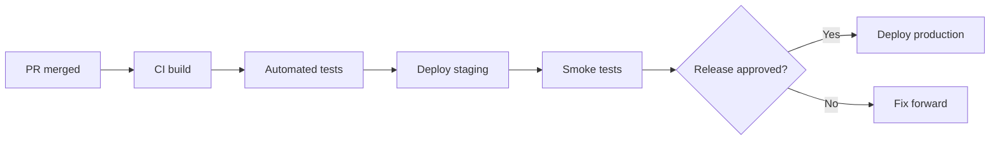

# Deployment (Developer Guide)

## Purpose

This document describes the **developer-facing** deployment process: how engineers build, verify, and promote software from local development to production. Infrastructure detail and runbooks live in [docs/Deployment/](../Deployment/); this handbook section covers what every developer must know before shipping.

## When to use it

- **Before first production deploy** — Required reading for anyone with deploy access.
- **Release day** — Follow the checklist below.
- **Hotfixes** — Coordinate with hotfix workflow in [03_Git_Workflow.md](./03_Git_Workflow.md).
- **Onboarding** — Understand environments and promotion path.
- **After CI changes** — Verify this doc still matches pipeline behavior.

## Suggested contents

---

## Environments

| Environment | Purpose | URL | Deploy trigger |
|-------------|---------|-----|----------------|
| Local | Development | `localhost` | Manual |
| CI | Automated tests | _[N/A]_ | Every PR |
| Staging | Pre-production validation | _[https://staging.example.com]_ | Merge to `main` |
| Production | Live users | _[https://app.example.com]_ | Tagged release / manual approval |

### Environment parity

- Staging should mirror production: _[same container image / similar data scale / feature flags]_.
- Document known differences: _[e.g., third-party sandbox vs live API]_.

---

## Deployment pipeline overview



Detailed pipeline configuration: [docs/Deployment/](../Deployment/)

---

## Pre-deployment checklist (developer)

Before requesting or executing a production deploy:

- [ ] All PRs for this release merged to `main`
- [ ] `CHANGELOG.md` updated
- [ ] Version tag created (if applicable): `vX.Y.Z`
- [ ] Database migrations reviewed and reversible if required
- [ ] Feature flags configured for gradual rollout (if used)
- [ ] Tests pass in CI including integration/E2E as required
- [ ] Staging smoke tested: _[link to smoke test script or steps]_
- [ ] Deployment and rollback steps reviewed
- [ ] On-call notified for high-risk releases: _[channel / person]_

---

## Build artifacts

| Artifact | Produced by | Stored at |
|----------|-------------|-----------|
| _[Container image]_ | _[CI job name]_ | _[registry URL]_ |
| _[Static assets]_ | _[build command]_ | _[CDN / bucket]_ |
| _[Migration bundle]_ | _[tool]_ | _[location]_ |

**Immutable releases:** Production deploys reference immutable tags — never `latest` in production.

---

## Deployment steps (summary)

Full runbooks: [docs/Deployment/](../Deployment/)

### Staging

```bash
# Example — replace with project commands
# ./scripts/deploy.sh staging
# or: gh workflow run deploy-staging.yml
```

### Production

```bash
# Example — typically requires approval
# ./scripts/deploy.sh production v1.2.3
```

### Post-deploy verification

1. Health check: `_[URL or command]_`
2. Smoke test suite: `_[command or manual steps]_`
3. Monitor dashboards: _[links]_
4. Watch error rates for _[duration]_

---

## Database migrations

| Rule | Detail |
|------|--------|
| Backward compatibility | Prefer expand–contract pattern for zero-downtime |
| Review | DBA or data owner approves risky migrations |
| Order | Run migrations _[before / after]_ application deploy — state preference |
| Rollback | Document rollback limitations (some migrations are one-way) |

Migration docs: [docs/Database/](../Database/)

---

## Feature flags and configuration

- Feature flags managed in: _[tool or config location]_
- Default new flags to **off** in production until verified.
- Document flag lifecycle: create → staging → partial prod → full → remove.

Environment variables: document names in deployment docs; values in secret manager only.

---

## Rollback procedure

If production deploy fails or critical bugs appear:

1. **Assess** — Severity, blast radius, data migration state.
2. **Decide** — Roll back application, forward fix, or feature-flag off.
3. **Execute** — `_[rollback command or redeploy previous tag]_`
4. **Verify** — Health checks and key user flows.
5. **Communicate** — Status page / stakeholders per incident process.
6. **Follow up** — Post-incident doc in `docs/Deployment/` or `archive/`.

**Previous production tag:** `_[how to find last known good tag]_`

---

## Access and permissions

| Action | Who can perform |
|--------|-----------------|
| Deploy staging | _[All engineers / CI only]_ |
| Deploy production | _[Release manager, on-call, senior engineers]_ |
| Database migration (prod) | _[Named roles]_ |
| Secret rotation | _[DevOps / security]_ |

Request access via: _[process]_

---

## Monitoring and alerts

After deploy, monitor:

- _[APM dashboard link]_
- _[Error tracking — Sentry, etc.]_
- _[Infrastructure metrics]_

Alert on-call for: _[error rate threshold, latency, failed health checks]_

---

## Release communication

| Audience | Channel | Content |
|----------|---------|---------|
| Internal team | _[Slack #releases]_ | Version, changes, risks |
| Stakeholders | _[Email]_ | High-level summary |
| Users | _[Release notes / changelog public URL]_ | User-visible changes |

---

## Relationship to other docs

| Topic | Document |
|-------|----------|
| Infrastructure, K8s, Terraform | [docs/Deployment/](../Deployment/) |
| Local environment | [01_Development_Environment.md](./01_Development_Environment.md) |
| Git tagging and branches | [03_Git_Workflow.md](./03_Git_Workflow.md) |
| Test gates before release | [05_Testing.md](./05_Testing.md) |

---

## Maintenance

| Field | Value |
|-------|-------|
| **Document owner** | _[DevOps lead / release manager]_ |
| **Last reviewed** | _[YYYY-MM-DD]_ |
| **Review cadence** | _[After each pipeline change or quarterly]_ |
