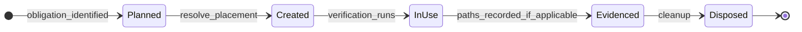

# DVW-0001: Disposable Verification Workspaces

[Home](../../README.md) › [Project Index](../../PROJECT_INDEX.md) › [Specifications](README.md) › DVW-0001

## Document Metadata

| Field | Value |
|---|---|
| **Document Type** | Architecture Specification |
| **Normative** | Yes |
| **Status** | Proposed |
| **Specification ID** | DVW-0001 |
| **Version** | 1.1 |
| **Date** | 2026-09-28 |
| **Owner** | Engineering Documentation Framework |
| **Authoritative** | Yes |

## Purpose

Define adoptable **EDF Core** requirements for **Disposable Verification Workspaces (DVW)** — filesystem workspaces used solely as **non-valuable subjects** of verification when engineering tools, tests, or governed manual procedures require directories on disk.

This specification does **not** redefine [Manual Verification Records (MVR)](MVR-0001-Manual-Verification-Records.md). It defines where and how disposable filesystem subjects **MAY** or **MUST** be created, selected, isolated, used, evidenced, and disposed.

## Scope

### In scope

- Definition of a Disposable Verification Workspace and explicit distinction from related concepts
- Semantics-first placement and isolation requirements
- Safety defaults for destructive, relocation, move, and mutation-oriented verification
- Cleanup expectations for manual and automated verification
- Relationship to governed manual verification records, committed test fixtures, and in-repository transient operational output
- Implementation-neutral requirements (no mandated Core directory layout for fixtures)

### Out of scope

- MVR structure, MVT identity, human execution status, or gate integration (see [MVR-0001](MVR-0001-Manual-Verification-Records.md))
- Tool-specific UI, parsers, or product operational-state stores
- Framework Advisor or automated conformance checks for DVW in this specification tranche
- Allocation of global EDF identifiers to individual DVW instances
- Prescription of a universal literal filesystem path (for example `~/tmp` or `./tmp`)
- Mandatory Core paths such as `tests/fixtures/`
- Persisted DVW lifecycle state machines in adopting projects or tools

## Normative Requirements

### Definition

1. A **Disposable Verification Workspace (DVW)** is a **filesystem workspace** consisting of **one directory** or a **coordinated set of directories** created or selected **solely** as a **non-valuable subject** of verification.

2. Typical uses include, without limitation: manual UI verification; folder-picker flows; open-project or open-workspace tests; relocation, move, or missing-path recovery tests; integration tests requiring filesystem roots; mutation-safety verification; and temporary stand-in engineering project roots for tools that accept arbitrary paths.

3. Individual DVW instances **MUST NOT** receive globally governed EDF identifiers. Concrete paths used during a verification run are **execution or evidence metadata** (for example recorded on an MVR or test log), not canonical engineering artifacts.

### Explicit distinctions

4. A DVW **is not** any of the following, and these concepts **MUST NOT** be conflated:

   | Concept | Role relative to DVW |
   |---|---|
   | **Adopting Project Root** | The governed EDF repository (or equivalent valuable project tree) relied on for real engineering work — **not** the default DVW subject |
   | **Canonical engineering documentation** | Governed prose and structured documents under `docs/` and related Core domains |
   | **Manual Verification Record (MVR)** | Governed verification **procedure and execution record** under `docs/Verification/Records/` |
   | **In-repository transient operational output** | For example Framework Advisor output under `reports/` — tool-generated evidence **inside** the adopting project root, excluded from version control by project policy |
   | **Product or application per-user operational state** | For example OS application-data databases or caches — not a filesystem stand-in project root |
   | **Committed deterministic test fixture** | Version-controlled test input; separate permitted pattern (see §Committed fixtures) |
   | **Git repository identity** | A DVW is not necessarily a Git repository |
   | **EDF adoption status** | A DVW is not necessarily an EDF-adopted repository |

5. A DVW **MUST NOT** be used to bypass governed documentation requirements. Verification subjects on disk do not substitute for MVRs, specifications, ADRs, or other required governed records.

### Placement

6. DVW placement **MUST** be defined **semantics-first**. This specification **MUST NOT** prescribe a universal literal path such as `~/tmp` or `./tmp`.

7. By default, a DVW **MUST** be resolved **outside** any **valuable** or **adopting** repository working tree.

8. **Human-interactive DVWs:** When a human operator **MUST** browse to, type, inspect, move, rename, select, or otherwise **directly interact** with DVW paths as part of governed manual verification, the DVW **SHOULD** use a **short, recognizable, readily navigable, user-writable disposable** location **when practical**. Non-normative examples include a dedicated folder under the operator home directory (for example a project- or tool-specific verification folder with a short path). Platform-generated temporary directories **MAY** be used but **SHOULD NOT** be preferred when their path complexity **materially burdens** human verification. *(Non-normative motivation only:* host environments may present long or alias-prone temp paths to folder dialogs; this specification does **not** define path canonicalization or identity equivalence rules.)*

9. **Automation-oriented DVWs:** When a DVW is created and consumed **primarily by automation** (for example test harnesses, CI jobs, or scripted setup), resolution **SHOULD** use **platform-appropriate user-writable temporary-storage semantics** — a directory intended for short-lived, user-writable data on the host environment. This is generally the **preferred** implementation choice for automation-oriented DVWs. Non-normative examples include: the `TMPDIR` environment variable on Unix-like systems; `%TEMP%` or `%TMP%` on Windows; or runtime facilities that resolve the user temporary directory (without mandating any specific API or language).

10. Where useful, verification **SHOULD** use a **dedicated verification-session directory** under the chosen placement base (human-interactive or automation-oriented) so paths are grouped and identifiable. A non-normative naming pattern is `{ProjectOrToolIdentifier}-{VerificationSessionOrTrancheId}-QA`.

11. Individual **role directories** **MAY** exist beneath a session directory (for example `Root-A`, `Root-B`, `Root-A-Relocated`). Such names are **examples only**; they are not canonical EDF directory names.

12. DVW placement **MUST NOT** be confused with in-repository `reports/` output. `reports/` holds transient **tool-generated** evidence within the adopting project root; a DVW holds **filesystem subjects** used during verification, defaulting **outside** that root.

13. DVWs created in conformance with DVW-0001 v1.0 placement guidance **remain valid**. This §Placement guidance applies **prospectively** when choosing locations for **future** DVWs.

### Safety

14. Verification that is **destructive**, **relocation-oriented**, **move-oriented**, **mutation-oriented**, or otherwise risks unintended filesystem change **MUST** default to **disposable, non-valuable** workspace subjects (DVWs).

15. A **valuable Adopting Project Root** **MUST NOT** be used for such testing **by default**.

16. Operation against a real adopting project **MAY** occur only when the **governing verification procedure** (for example an MVT on an MVR, or an explicitly scoped automated test plan) **explicitly requires** it **and** documents **appropriate safeguards** (such as backup, scope limits, rollback, or use of a non-production clone).

17. Relocation, move, and missing-locator simulation **MUST** use disposable workspace subjects unless §16 applies.

18. **Optional sentinel content:** A DVW **MAY** contain minimal harmless files (for example a single `README.txt`) to detect unintended mutation. Sentinel content **MUST NOT** be required to form an EDF-canonical tree unless the verification obligation explicitly tests EDF detection or adoption behavior.

### Lifecycle (conceptual phases — not persisted state)

19. The following phases describe **conceptual** lifecycle semantics for reasoning and documentation. Adopting projects, tools, and MVR implementations **MUST NOT** be required to persist a DVW lifecycle state machine or enumerated DVW status field.

20. Normative obligations attach to **actions and conditions** during verification:

    | Conceptual phase | Normative obligations |
    |---|---|
    | **Planned** | Governing verification identifies whether disposable filesystem subjects are required. |
    | **Created / selected** | DVW directories **MUST** be created or selected per §Placement and **MUST** satisfy §Safety. |
    | **In use** | Tooling and operators **MUST** restrict declared verification activity to the intended DVW paths. |
    | **Evidenced** | Where applicable, governing records (for example MVR execution record or test logs) **SHOULD** record **concrete paths used** as metadata, not as new canonical artifacts. |
    | **Disposed** | Cleanup per §Cleanup. |

21. *(Conceptual diagram — non-normative)* The phases above may be illustrated for human readers; diagrams do not introduce additional requirements.

### Cleanup

22. **Manual verification:** The operator **SHOULD** dispose of DVW content after verification completes successfully, or after **Fail** or **Blocked** disposition, once retained debugging or evidence needs have ended.

23. **Automated verification:** Ephemeral DVWs **MUST** be cleaned up through test or harness **teardown**, **`finally`**, or **dispose** semantics (whether the test passes or fails).

24. DVW content **MUST NOT** be required to become canonical version-controlled evidence. Execution truth and evidence references remain on the governing verification record (for example MVR execution record) or test output, per project policy.

### Relationship to Manual Verification Records

25. This specification **MUST NOT** redefine [MVR-0001](MVR-0001-Manual-Verification-Records.md).

26. Conceptual roles:

    | Artifact | Role |
    |---|---|
    | **MVR** | Governed verification **procedure** and **execution record** |
    | **DVW** | Disposable **filesystem subject** or workspace used during verification |

27. An MVR **MAY** reference concrete DVW paths in procedures, notes, or evidence tables. Those paths are **execution or evidence metadata**, not new canonical engineering artifacts and not a substitute for MVR structure or execution truth.

28. Successful automated test execution **does not** satisfy governed human manual verification obligations defined under MVR-0001.

### Automated testing

29. Automated tests that create filesystem roots for verification **SHOULD** conform to §Placement, §Safety, and §Cleanup.

30. Tests **MUST NOT** hardcode machine-specific absolute paths except through platform temporary-storage resolution semantics or other placement rules in §Placement that apply to automation-oriented DVWs.

31. This specification **MUST NOT** mandate specific programming-language or runtime APIs for temporary directories in EDF Core.

### Committed deterministic test fixtures

32. A **committed deterministic test fixture** is **version-controlled** test input maintained for reproducibility. Its path is chosen by the adopting project (Software Engineering profile handbook or project convention). EDF Core **MUST NOT** mandate a universal fixture directory such as `tests/fixtures/`.

33. A **hybrid** pattern **MAY** copy or seed from a committed fixture into an ephemeral DVW so mutation tests do not alter the version-controlled fixture tree in place.

34. A committed fixture **is not** a DVW. A DVW **is not** necessarily a committed fixture.

### Relationship to other artifacts

35. DVW semantics are complementary to [ADR-0006](../Architecture/ADRs/ADR-0006-Engineering-Documentation-vs-Artifacts.md): governed documentation remains in `docs/`; DVW directories are not a documentation domain and **MUST NOT** imply a new `docs/` subdomain.

36. Product or application per-user operational state (caches, registries, session databases) **MUST** be treated as separate from DVW subjects unless a product-specific specification explicitly documents otherwise.

## Conformance

An adopting project or tool conforms to DVW-0001 when, for verification that requires disposable filesystem subjects:

- Default placement follows §Placement (outside valuable adopting repositories; semantics-first; human-interactive vs automation-oriented rules),
- Safety rules in §Safety are satisfied (including defaults for destructive or relocation-oriented work),
- Cleanup expectations in §Cleanup are met for the verification mode (manual or automated),
- DVWs are not conflated with MVRs, adopting project roots, `reports/`, committed fixtures, or product operational state, and
- Governing verification records reference DVW paths only as execution or evidence metadata where needed.

Absence of verification that requires disposable filesystem subjects is not nonconformance.

## Rationale

Verification increasingly depends on opening arbitrary directories, simulating relocation, and proving tools do not mutate valuable repositories. Without Core semantics, adopters invent incompatible path conventions (for example ad hoc `~/tmp` trees) that are neither portable nor safely distinguished from adopting project roots, MVR records, or in-repo `reports/` evidence.

DVW-0001 establishes portable placement and safety semantics while leaving profile-specific fixture paths and runtime APIs to adopting projects. Human-interactive placement guidance reduces operator burden in folder dialogs and similar workflows without mandating a universal DVW root or altering DVW identity semantics.

## Parent

- [Specifications](README.md)

## Related Documents

- [MVR-0001 — Manual Verification Records](MVR-0001-Manual-Verification-Records.md)
- [ADR-0006 — Engineering Documentation vs Artifacts](../Architecture/ADRs/ADR-0006-Engineering-Documentation-vs-Artifacts.md)
- [General Engineering Project Model](../Architecture/General_Engineering_Project_Model.md)
- [Documentation Information Architecture](../Architecture/Documentation_Information_Architecture.md)
- [Glossary](../Reference/Glossary.md)
